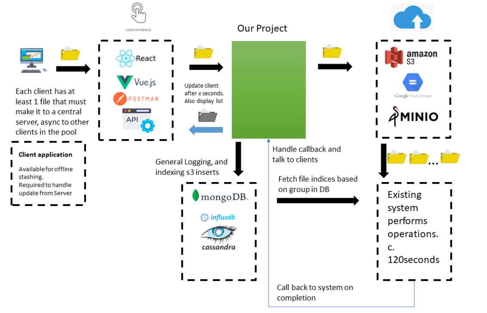
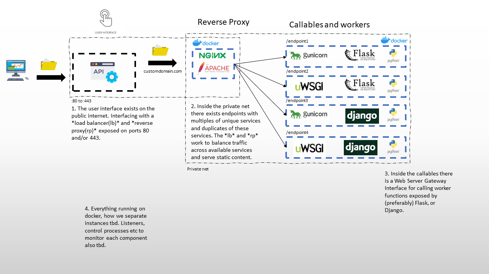
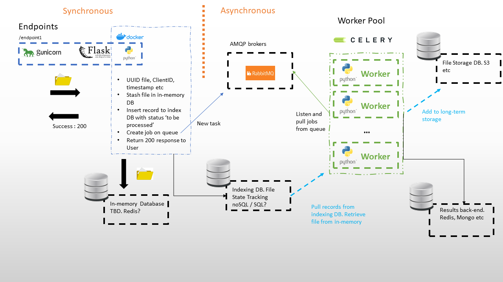
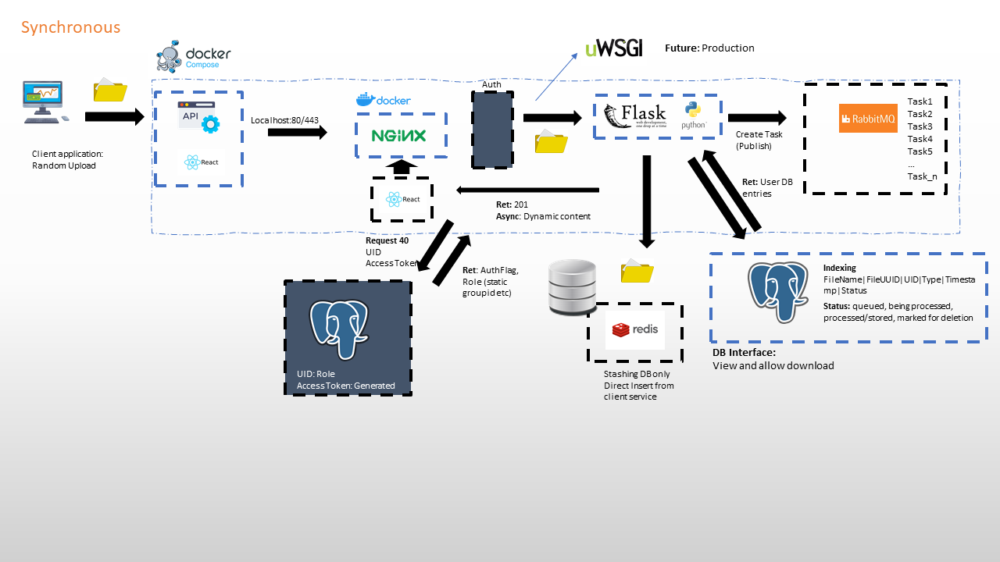
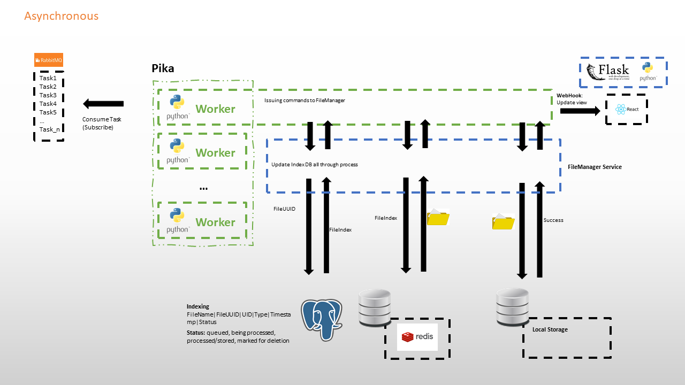
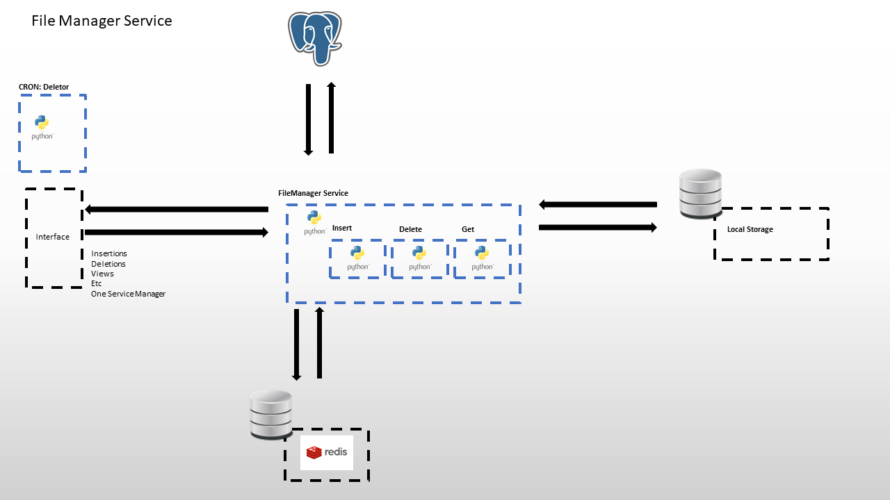

# 2020_group_12_s3993914_s4091221_s4199456

## Problem Statement
There is a requirement for a system which allows clients to connect to a pool on a hosted system to upload files and periodically receive async updates after some time. Multiple pools can be running simultaneously that require some Identity and Access Management. A client pool may consist of 2 to thousands of client applications. Each client application performs some task that produces a file that is required by a hosted server. Each client in the pool generates these files asynchronously (some clients may even be listeners and provide no updates) and sends them to our project system through an API for processing, there is a user defined update frequency from minutes to days required. Some clients may not be able to send updates immediately and will cache local updates until a batched update can be sent with multiple timestamps contained. 

The file size(s) being sent are 100’s of Kbs to 10’s of Mbs. Although sending updates asynchronously, it is required that batches from similar timestamps are grouped, this can be through the range on the timestamp, or otherwise. A server, external to this system, will request a group's files at a given trigger event. The external server will then perform some operation for roughly 2 minutes. On completion the external server will return to our project system a single file intended to be shared back down to the entire client pool. 
	

## Technologies

General overiew of architecture. Taking in a file on an exposed Nginx server at ports 80/443. Handling flow through internal services hosted in docker containers, sitting behind a WSGI (flask development for testing).

Synchronous portion of application returns success on successful stashing to in-memory DB, insert to index DB, and new task published on RabbitMQ server. Asynchornous side of application: Subscribers listening for jobs.

More detailed view of synchronous side of application. Including dumb authenticator. Client supplying ID, Auth checks SQL DB for roles, returns role (Cookies, central, TBD).

Example of Asynchronous worker and flow of application returning update views to web app on completion.

Dedicated file manager service to handle any communications between internal services and DB's.

Example File retrieval flow.
